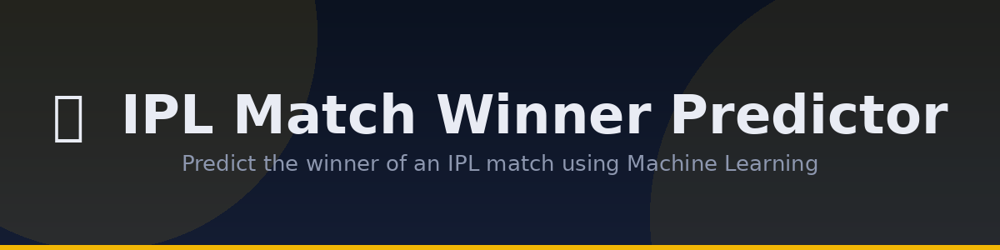
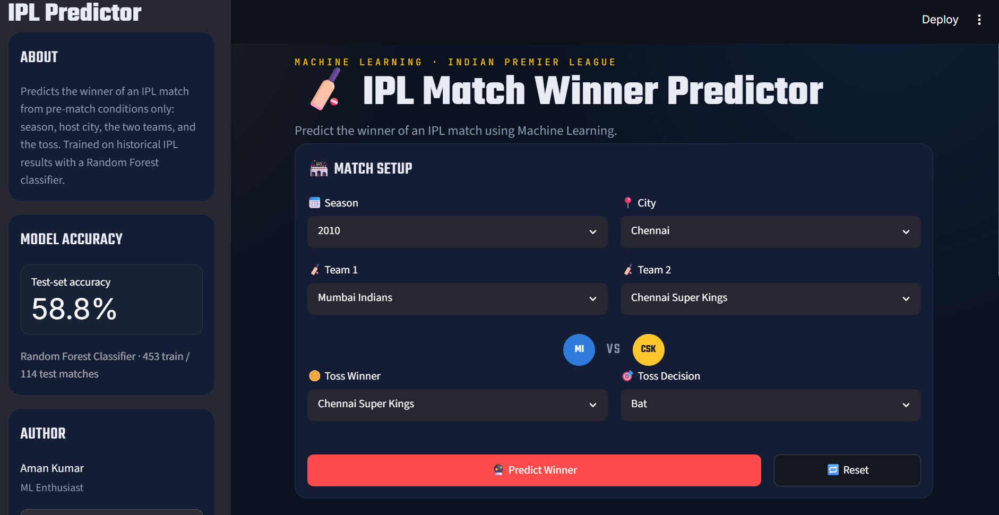
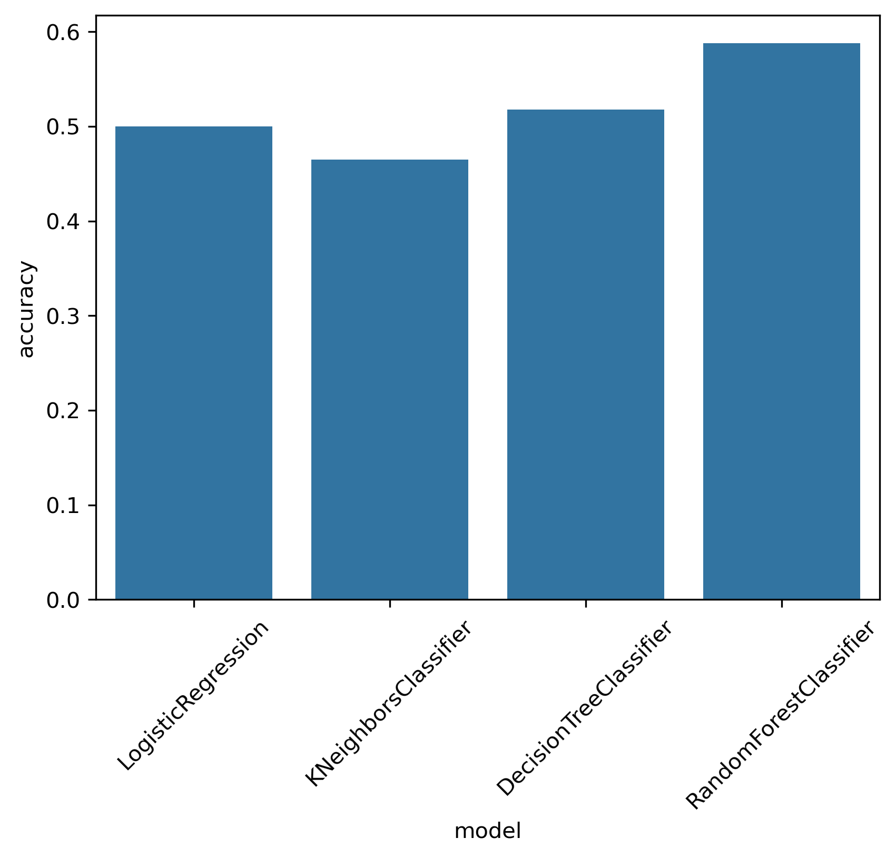

<p align="center">
  
</p>


## 📌 Project Overview

This project predicts the winner of an IPL match using a **Random Forest Classifier** trained on historical IPL match data (2008–2016).

The application allows users to select:

- Season
- City
- Team 1
- Team 2
- Toss Winner
- Toss Decision

and returns:

- 🏆 Predicted Winner
- 📊 Winning Probability for both teams
- 📈 Model Information

The machine learning workflow was built using **Scikit-Learn Pipelines**, while the prediction interface is implemented using **Streamlit**.

---

## Demo



---

## Features

- Interactive Streamlit web application
- Random Forest prediction model
- Winning probability visualization
- Prediction history
- Input validation
- Dark-themed responsive UI
- Automatic preprocessing using Scikit-Learn Pipeline
- Model information panel

---

##  Dataset

- **Source:** IPL Matches Dataset
- **Matches:** 577
- **Usable Matches:** 567
- **Seasons:** 2008–2016

The following input features are used:

- Season
- City
- Team 1
- Team 2
- Toss Winner
- Toss Decision

Target:

- Match Winner

---

## 🤖 Machine Learning Workflow

```
Dataset
      │
      ▼
Data Cleaning
      │
      ▼
Feature Selection
      │
      ▼
Train-Test Split
      │
      ▼
ColumnTransformer
      │
      ▼
OneHotEncoder
      │
      ▼
Random Forest Classifier
      │
      ▼
Prediction
```

---

##  Model Comparison
<>
---

## 🛠 Tech Stack

- Python
- Pandas
- NumPy
- Matplotlib
- Seaborn
- Scikit-Learn
- Streamlit
- Joblib
---

## 🚀 How to Run

### 1. Clone the repository

```bash
git clone https://github.com/Amank0106/ipl-match-analysis.git
cd ipl-match-analysis
```

Or download the repository as a ZIP file and extract it.

---

### 2. Open Anaconda Prompt

Navigate to the project folder.

Example:

```bash
cd path/to/ipl-match-analysis
```

---

### 3. Install the required packages

```bash
pip install -r requirements.txt
```

---

### 4. Launch the application

```bash
streamlit run app.py
```

If Streamlit is not recognized, use:

```bash
python -m streamlit run app.py
```

The application will automatically open in your default browser (usually at **http://localhost:8501**).

### 4. Retrain the model (Optional)

The trained model (`pipeline.pkl`) is already included in the repository.

If you'd like to retrain it using the dataset:

```bash
python train_model.py
```

This will generate a new `pipeline.pkl` file.

##  Model Details

- **Algorithm:** Random Forest Classifier
- **Preprocessing:** ColumnTransformer + OneHotEncoder
- **Train/Test Split:** 80/20
- **Training Samples:** 453
- **Testing Samples:** 114
- **Random State:** 42

---

## Future Improvements

- Hyperparameter tuning using GridSearchCV
- Team win-rate feature engineering
- Head-to-head statistics
- Venue-wise performance
- Recent form (last 5 matches)
- XGBoost / LightGBM comparison
- Model explainability using SHAP

---

## Acknowledgements

The **EDA, feature selection, preprocessing pipeline, model training, evaluation, and machine learning workflow** were developed by me.

AI assistance was used to:
- make the Streamlit interface
- Refactor and organize the project structure
- Enhance documentation and code readability

---

## ⭐ If you found this project interesting, consider giving it a star!
